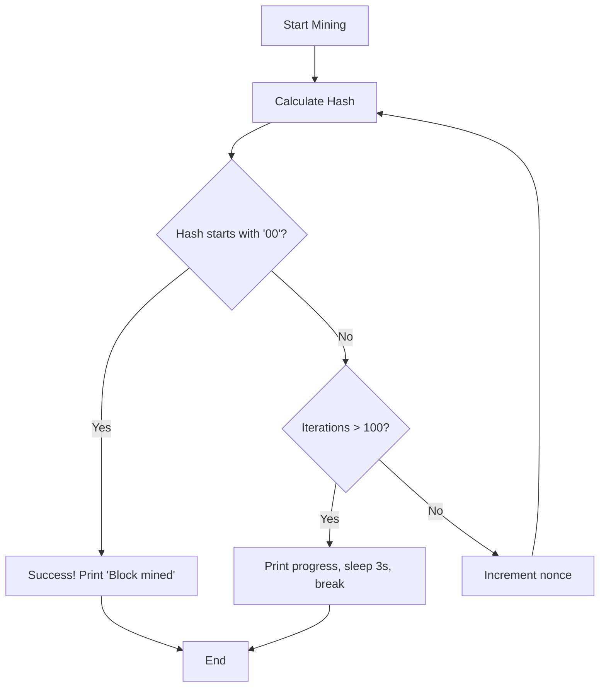

# Step-by-Step Walkthrough of the Blockchain Simulator

A comprehensive guide to understanding how this Rust blockchain simulator works, explained in student-friendly terms.

---

## Table of Contents

1. [Overview](#overview)
2. [Imports & Constants](#1-imports--constants)
3. [Block Structure](#2-block-structure)
4. [Block Constructor](#3-block-constructor)
5. [Hash Calculation](#4-hash-calculation)
6. [Mining Process](#5-mining-process)
7. [Display Implementation](#6-display-implementation)
8. [Blockchain Structure](#7-blockchain-structure)
9. [Main Simulation Flow](#8-main-simulation-flow)
10. [Example Output](#9-example-output)
11. [Known Issues & Improvements](#10-known-issues--improvements)
12. [Summary](#11-summary)

---

## Overview

This is a tiny Rust blockchain simulator that demonstrates:
- **Blocks**: Data structures containing transactions
- **Mining**: Proof-of-work algorithm to secure blocks
- **Chain**: Linked blocks forming an immutable ledger
- **Transactions**: Simple "Send X to Y" operations

---

## 1) Imports & Constants

```rust
use sha2::{Digest, Sha256};
use std::fmt;
use std::time::{SystemTime, UNIX_EPOCH};
use std::thread;
use std::time::Duration;

const DIFFICULTY: usize = 2;
```

### What each import does:

| Import | Purpose |
|--------|---------|
| `sha2` | Provides SHA-256 cryptographic hashing |
| `fmt` | Enables pretty-printing blocks with `Display` trait |
| `SystemTime` / `UNIX_EPOCH` | Fetches current time as seconds since Unix epoch |
| `thread` + `Duration` | Allows thread sleeping for mining visualization |

### DIFFICULTY Constant

- **Value**: `2`
- **Meaning**: Mined hash must start with `"00"` (two zeros) in hexadecimal
- **Impact**: Higher difficulty = harder mining = more computation needed

---

## 2) Block Structure

```rust
struct Block {
    index: u32,
    previous_hash: String,
    timestamp: u64,
    data: String,
    nonce: u64,
    hash: String,
}
```

### Field Breakdown

| Field | Type | Description |
|-------|------|-------------|
| `index` | `u32` | Block height (0 = genesis block) |
| `previous_hash` | `String` | Hex hash of previous block (creates chain link) |
| `timestamp` | `u64` | Unix timestamp (seconds since epoch) |
| `data` | `String` | Transaction payload (e.g., "Send Alice to Bob") |
| `nonce` | `u64` | Counter incremented during mining to change hash |
| `hash` | `String` | This block's computed SHA-256 hex string |

### Why This Matters

The `previous_hash` field is what makes this a **blockchain** - each block points to the previous one, creating an immutable chain. Changing any past block would break all subsequent blocks.

---

## 3) Block Constructor

```rust
fn new(index: u32, previous_hash: String, data: String) -> Block {
    let timestamp = SystemTime::now()
        .duration_since(UNIX_EPOCH)
        .expect("Time went backwards")
        .as_secs();
    Block {
        index,
        previous_hash,
        timestamp,
        data,
        nonce: 0,
        hash: String::new(),
    }
}
```

### What Happens Here

1. **Captures current time** as Unix timestamp
2. **Initializes nonce to 0** (will be incremented during mining)
3. **Leaves hash empty** (will be calculated during mining)

> ⚠️ **Important**: The genesis block is created via this constructor but is **not** automatically mined, so its hash remains empty.

---

## 4) Hash Calculation

```rust
fn calculate_hash(&self) -> String {
    let data = format!(
        "{}{}{}{}{}",
        self.index, self.previous_hash, self.timestamp, self.data, self.nonce
    );
    let mut hasher = Sha256::new();
    hasher.update(data.as_bytes());
    let result = hasher.finalize();
    format!("{:x}", result)
}
```

### The Process

1. **Concatenate** all block fields into a single string:
   ```
   index + previous_hash + timestamp + data + nonce
   ```

2. **Hash** the concatenated string using SHA-256

3. **Return** the hash as a 64-character hexadecimal string

### Why This Works

Changing **any** field (even just incrementing the nonce) produces a completely different hash. This unpredictability is what makes proof-of-work secure.

### Example

```
Input:  "10abc123456789Send Alice to Bob42"
Output: "00a3f5d8e9c1b2a4f6e8d9c1b2a4f6e8d9c1b2a4f6e8d9c1b2a4f6e8d9c1b2a4"
```

---

## 5) Mining Process

```rust
fn mine_block_with_visulisation(&mut self) {
    let mut iterations = 0;
    loop {
        self.hash = self.calculate_hash();
        iterations += 1;
        if !self.hash.is_empty() && &self.hash[..DIFFICULTY] == "00".repeat(DIFFICULTY) {
            println!("Block mined : {}", self.index);
            break;
        }
        if iterations > 100 {
            println!("Mining in progress...");
            thread::sleep(Duration::from_millis(3000));
            println!("calculated_hash: {}", self.hash);
            break;
        }
        self.nonce += 1;
    }
}
```

### Mining Algorithm Flow



### Step-by-Step

1. **Calculate hash** with current nonce
2. **Check if valid**: Does hash start with required zeros?
3. **If valid**: Print success message and exit
4. **If not valid**: 
   - Check if we've tried more than 100 times
   - If yes: Show progress, sleep, and exit (⚠️ **bug - see below**)
   - If no: Increment nonce and try again

### ⚠️ Important Gotcha

The `iterations > 100` check causes the function to **break without finding a valid hash**. This means:

- Invalid blocks can be added to the chain
- The visualization timeout overrides proof-of-work security
- In a real blockchain, this would be a critical bug

---

## 6) Display Implementation

```rust
impl fmt::Display for Block {
    fn fmt(&self, f: &mut fmt::Formatter<'_>) -> fmt::Result {
        let datetime = chrono::DateTime::from_timestamp(self.timestamp as i64, 0)
            .expect("Invalid timestamp")
            .naive_utc();
        write!(f, "Block {} : {} at {}", self.index, self.data, datetime)
    }
}
```

### What This Does

Enables pretty-printing blocks with `println!("{}", block)`:

```
Block 1 : Send Alice to Neha at 2025-12-12 12:47:53
```

### Breakdown

1. **Converts** Unix timestamp to human-readable datetime
2. **Formats** as: `Block [index] : [data] at [datetime]`

---

## 7) Blockchain Structure

```rust
struct Blockchain {
    chain: Vec<Block>,
}

impl Blockchain {
    fn new() -> Blockchain {
        let genesis_block = Block::new(0, String::new(), String::from("Genesis Block"));
        Blockchain { chain: vec![genesis_block] }
    }

    fn add_block(&mut self, mut new_block: Block) {
        let previous_hash = self.chain.last().unwrap().hash.clone();
        new_block.previous_hash = previous_hash;
        new_block.mine_block_with_visulisation();
        self.chain.push(new_block);
    }

    fn get_total_blocks(&self) -> usize {
        self.chain.len()
    }
}
```

### Methods Explained

#### `new()` - Creates the Blockchain

- Creates a **genesis block** (index 0)
- Genesis has empty `previous_hash` (it's the first block)
- Initializes chain with just the genesis block

> ⚠️ **Gotcha**: Genesis block's hash is never calculated, so it remains empty. This means block 1's `previous_hash` will be `""`.

#### `add_block()` - Adds a New Block

1. **Get** the hash of the last block in the chain
2. **Set** new block's `previous_hash` to that hash
3. **Mine** the new block (find valid hash)
4. **Push** the mined block onto the chain

#### `get_total_blocks()` - Returns Chain Length

Simple helper to count blocks (including genesis).

---

## 8) Main Simulation Flow

### High-Level Overview


### Detailed Code Flow

#### Step 1: Welcome & Input

```rust
println!("Welcome to the Blockchain stimulator!");
println!("Enter your miner name : ");

let mut miner_name = String::new();
std::io::stdin()
    .read_line(&mut miner_name)
    .expect("Failed to read line");
miner_name = miner_name.trim().to_string();
```

Prompts user for their name (used as initial sender).

#### Step 2: Setup Traders

```rust
let trader_names = vec![
    "Neha", "Subh", "Tiya", "Naina", "Prakhar", 
    "Prapti", "Toly", "Kate", "Jane", "Sourav"
];
```

Hardcoded list of 10 traders for simulation.

#### Step 3: Create Blockchain

```rust
let mut blockchain = Blockchain::new();
```

Initializes blockchain with genesis block.

#### Step 4: Mining Loop

```rust
let mut sender = miner_name.clone();

for i in 0..trader_names.len() {
    println!("Mining Block {} ...", i + 1);
    
    let recipient = if i < trader_names.len() - 1 {
        trader_names[i + 1].to_string()
    } else {
        miner_name.clone()
    };
    
    let transaction = format!("Send {} to {}", sender, recipient);
    let new_block = Block::new((i+1) as u32, String::new(), transaction.clone());
    
    blockchain.add_block(new_block);
    
    println!("Transaction added : {}", transaction);
    sender = recipient;
    println!();
}
```

**What happens in each iteration:**

1. **Determine recipient**: Next trader in list (or back to miner for last block)
2. **Create transaction**: `"Send [sender] to [recipient]"`
3. **Create new block** with empty `previous_hash` (will be set in `add_block`)
4. **Mine and add** block to chain
5. **Update sender** to current recipient (for next transaction)

**Transaction Chain Example:**
```
Miner → Neha → Subh → Tiya → ... → Sourav → Miner
```

#### Step 5: Display Results

```rust
let total_blocks = blockchain.get_total_blocks();
println!("\nTotal number of blocks : {}", total_blocks);

println!("\nBlockchain contents:");
for block in blockchain.chain.iter() {
    println!("{}", block);
}
```

Prints total blocks and full blockchain.

#### Step 6: Calculate Statistics

```rust
let novacoin_per_block: usize = 10;
let novacoin_traded: usize = total_blocks * novacoin_per_block;

println!("💰 Total NovaCoin traded: {} NovaCoin", novacoin_traded);

let end_timestamp: u64 = SystemTime::now()
    .duration_since(UNIX_EPOCH)
    .expect("Time went backwards")
    .as_secs();

let end_datetime: Option<chrono::DateTime<chrono::Utc>> = 
    chrono::DateTime::from_timestamp(end_timestamp as i64, 0);

println!("⏰ Simulation ended at: {}", end_datetime.unwrap());
println!("🎉 Congrats! Mining operation completed successfully!");
```

Shows:
- Total NovaCoin traded (10 per block)
- Simulation end time
- Success message

---

## 9) Example Output

```
Welcome to the Blockchain stimulator!
Enter your miner name : 
Alice

 Let's start mining and stimulating transactions!
Mining Block 1 ...
Block mined : 1
Transaction added : Send Alice to Neha

Mining Block 2 ...
Block mined : 2
Transaction added : Send Neha to Subh

...

Total number of blocks : 11

Blockchain contents:
Block 0 : Genesis Block at 2025-12-12 12:47:50
Block 1 : Send Alice to Neha at 2025-12-12 12:47:53
Block 2 : Send Neha to Subh at 2025-12-12 12:47:56
...

💰 Total NovaCoin traded: 110 NovaCoin
⏰ Simulation ended at: 2025-12-12 12:48:15 UTC
🎉 Congrats! Mining operation completed successfully!
```

---

## 10) Known Issues & Improvements

### 🐛 Bug #1: Genesis Block Has No Hash

**Problem**: Genesis block is created but never mined, so its `hash` is empty.

**Impact**: Block 1's `previous_hash` is `""`, breaking chain integrity.

**Fix**:
```rust
fn new() -> Blockchain {
    let mut genesis_block = Block::new(0, String::new(), String::from("Genesis Block"));
    genesis_block.mine_block_with_visulisation();  // Mine it!
    Blockchain { chain: vec![genesis_block] }
}
```

---

### 🐛 Bug #2: Mining Can Timeout and Accept Invalid Blocks

**Problem**: After 100 iterations, mining stops even without a valid hash.

**Impact**: Invalid blocks (not satisfying difficulty) can enter the chain.

**Fix**: Remove the timeout break, or make it only for visualization:

```rust
fn mine_block_with_visulisation(&mut self) {
    let mut iterations = 0;
    loop {
        self.hash = self.calculate_hash();
        iterations += 1;
        
        if !self.hash.is_empty() && &self.hash[..DIFFICULTY] == "00".repeat(DIFFICULTY) {
            println!("Block mined : {}", self.index);
            break;
        }
        
        // Show progress every 100 iterations but keep mining
        if iterations % 100 == 0 {
            println!("Mining in progress... attempts: {}", iterations);
            println!("current hash: {}", self.hash);
            thread::sleep(Duration::from_millis(200));
        }
        
        self.nonce += 1;
    }
}
```

---

### 💡 Improvement #1: Add Chain Validation

**Why**: Verify blockchain integrity after operations.

**Implementation**:

```rust
impl Blockchain {
    fn is_valid(&self) -> bool {
        for i in 1..self.chain.len() {
            let current = &self.chain[i];
            let previous = &self.chain[i - 1];
            
            // Check if hash is correct
            if current.hash != current.calculate_hash() {
                return false;
            }
            
            // Check if previous_hash matches
            if current.previous_hash != previous.hash {
                return false;
            }
            
            // Check if hash satisfies difficulty
            if &current.hash[..DIFFICULTY] != "00".repeat(DIFFICULTY) {
                return false;
            }
        }
        true
    }
}
```

**Usage**:
```rust
if blockchain.is_valid() {
    println!("✅ Blockchain is valid!");
} else {
    println!("❌ Blockchain is corrupted!");
}
```

---

### 💡 Improvement #2: Make Difficulty Configurable

**Current**: Hardcoded `const DIFFICULTY: usize = 2;`

**Better**: Accept via command-line argument:

```rust
use std::env;

fn main() {
    let args: Vec<String> = env::args().collect();
    let difficulty = if args.len() > 1 {
        args[1].parse::<usize>().unwrap_or(2)
    } else {
        2
    };
    
    // Use difficulty variable instead of constant
}
```

**Usage**:
```bash
cargo run 3  # Difficulty = 3 (requires "000")
```

---

### 💡 Improvement #3: Add Transaction Amounts

**Current**: Transactions are just strings like `"Send Alice to Bob"`

**Better**: Add amounts:

```rust
struct Transaction {
    sender: String,
    recipient: String,
    amount: u64,
}

impl fmt::Display for Transaction {
    fn fmt(&self, f: &mut fmt::Formatter<'_>) -> fmt::Result {
        write!(f, "{} → {} ({} NovaCoin)", self.sender, self.recipient, self.amount)
    }
}
```

---

### 💡 Improvement #4: Add Unit Tests

```rust
#[cfg(test)]
mod tests {
    use super::*;

    #[test]
    fn test_hash_calculation() {
        let block = Block::new(1, String::from("prev"), String::from("data"));
        let hash1 = block.calculate_hash();
        let hash2 = block.calculate_hash();
        assert_eq!(hash1, hash2); // Same inputs = same hash
    }

    #[test]
    fn test_blockchain_creation() {
        let blockchain = Blockchain::new();
        assert_eq!(blockchain.get_total_blocks(), 1);
        assert_eq!(blockchain.chain[0].index, 0);
    }

    #[test]
    fn test_chain_validation() {
        let mut blockchain = Blockchain::new();
        blockchain.chain[0].hash = blockchain.chain[0].calculate_hash();
        
        let block = Block::new(1, blockchain.chain[0].hash.clone(), String::from("Test"));
        blockchain.add_block(block);
        
        assert!(blockchain.is_valid());
    }
}
```

**Run tests**:
```bash
cargo test
```

---

### 💡 Improvement #5: Better Visualization

**Add progress bar** or **live hash display**:

```rust
println!("⛏️  Mining block {}...", self.index);
for i in 0..5 {
    print!(".");
    std::io::stdout().flush().unwrap();
    thread::sleep(Duration::from_millis(100));
}
println!(" ✓");
```

---

## 11) Summary

### What We Learned

| Concept | Implementation |
|---------|----------------|
| **Blockchain** | Vector of linked blocks |
| **Block** | Struct with index, hash, previous_hash, data, nonce, timestamp |
| **Hashing** | SHA-256 on concatenated block fields |
| **Mining** | Loop incrementing nonce until hash satisfies difficulty |
| **Proof-of-Work** | Hash must start with N zeros (difficulty) |
| **Chain Integrity** | Each block's `previous_hash` links to previous block |

### Key Takeaways

1. **Immutability**: Changing any past block breaks all subsequent blocks
2. **Proof-of-Work**: Computational effort makes blockchain secure
3. **Cryptographic Hashing**: Unpredictable output ensures security
4. **Timestamps**: Create chronological record of transactions

### Current Limitations

- ❌ Genesis block not mined
- ❌ Mining can timeout and accept invalid blocks
- ❌ No chain validation
- ❌ Hardcoded difficulty
- ❌ No transaction amounts
- ❌ No persistence (blockchain lost on exit)

### Potential Enhancements

- ✅ Fix genesis block mining
- ✅ Remove mining timeout bug
- ✅ Add `is_valid()` chain validation
- ✅ Make difficulty configurable
- ✅ Add transaction amounts
- ✅ Implement persistence (save/load blockchain)
- ✅ Add merkle trees for efficient verification
- ✅ Create network layer for distributed nodes
- ✅ Implement smart contracts

---

## Next Steps

Want to improve this blockchain? Try:

1. **Fix the bugs** mentioned in section 10
2. **Add chain validation** to verify integrity
3. **Implement persistence** to save blockchain to disk
4. **Create a CLI** with commands like `mine`, `validate`, `show`
5. **Add a REST API** to interact with the blockchain over HTTP

---

**Happy Mining! ⛏️**

For more information, see:
- [README.md](README.md) - Project overview and usage
- [errors.md](errors.md) - Syntax errors that were fixed
- [Bitcoin Whitepaper](https://bitcoin.org/bitcoin.pdf) - Original blockchain concept
